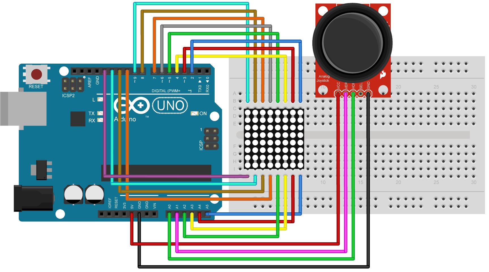

# Joystick Crosshair with 1088BS 8x8 LED Matrix

## Features

-   Read analog inputs from the joystick
-   Process joystick data
-   Control outputs based on joystick position
-   Send joystick data to 1088BS 8x8 LED Matrix and show the position as a dot, or as a 2x2 square when centered

## Wiring Diagram



### Label 1088BS is on the bottom side in diagram

## Requirements

-   Microcontroller (Arduino UNO)
-   Joystick module
-   1088BS 8x8 LED Matrix
-   Wires

## Usage

1. Connect the joystick to the microcontroller (GND, +5V, VRX -> A0, VRY -> A1). The REF's on the joystick may differ, HOR, VER and so on
2. Power up the microcontroller and upload the code

## Code

```cpp
#include <Arduino.h>

int R[] = {2, 7, A5, 5, 13, A4, 12, A2};
int C[] = {6, 11, 10, 3, A3, 4, 8, 9};

const int VRX = A0;
const int VRY = A1;

void Clear()
{
	for (int i = 0; i < 8; i++)
	{
		digitalWrite(R[i], LOW);
		digitalWrite(C[i], HIGH);
	}
}

void Display(unsigned char dat[8][8])
{
	for (int c = 0; c < 8; c++)
	{
		digitalWrite(C[c], LOW);

		for (int r = 0; r < 8; r++)
			digitalWrite(R[r], dat[r][c]);

		delay(1);
		Clear();
	}
}

void setup()
{
	for (int i = 0; i < 8; i++)
	{
		pinMode(R[i], OUTPUT);
		pinMode(C[i], OUTPUT);
	}
}

void loop()
{
	int xVal = analogRead(VRX) - 512;
	int yVal = analogRead(VRY) - 512;

	if (xVal >= -10 && xVal <= 10)
		xVal = 0;
	if (yVal >= -10 && yVal <= 10)
		yVal = 0;

	int mappedX = map(xVal, -512, 512, 0, 8);
	int mappedY = map(yVal, -512, 512, 0, 8);

	unsigned char matrix[8][8] = {0};

	if (xVal != 0 || yVal != 0)
		matrix[mappedY][mappedX] = 1;
	else
	{
		matrix[3][3] = 1;
		matrix[3][4] = 1;
		matrix[4][3] = 1;
		matrix[4][4] = 1;
	}

	Display(matrix);
}
```
